<!-- ░░░░░░░░░░░░░░░░░░ BANNER ░░░░░░░░░░░░░░░░░░ -->
<div align="center">



<a href="https://git.io/typing-svg">
  
</a>

<br/>


</div>

<br/>

<!-- ░░░░░░░░░░░░░░░░░░ CONNECT ░░░░░░░░░░░░░░░░░░ -->
<div align="center">

<a href="https://www.linkedin.com/in/mar%C3%ADa-alejandra-mar%C3%ADn-ter%C3%A1n-99314334b/">
  
</a>
<a href="mailto:maria1313marin@gmail.com">
  
</a>
<!-- <a href="https://YOUR_PORTFOLIO.com"></a> -->

</div>

<br/>

<!-- ░░░░░░░░░░░░░░░░░░ ABOUT ░░░░░░░░░░░░░░░░░░ -->
## `> about_me`

```js
const maria = {
  name:      "María Alejandra Marín",
  studies:   "Computer Engineering · UCAB · 6th semester",
  passion:   ["Database systems", "Software engineering"],
  strengths: ["Proactive", "Organized", "Responsible", "Teamwork"],
  stack:     ["JavaScript", "React", "Node.js", "PostgreSQL", "Docker", "n8n"],
  languages: { es: "Native", en: "Professional working" },
  mindset:   "If you can imagine it, you can code it.",
};
```

> I am a Computer Engineering student passionate about **database systems** and **software engineering**. I enjoy building end-to-end systems, from data modeling to user interfaces, ensuring that every layer is clean, well-structured, and easy to use. I am driven by continuous learning and adapting quickly to new environments.

<br/>

<!-- ░░░░░░░░░░░░░░░░░░ TECH STACK ░░░░░░░░░░░░░░░░░░ -->
## `> tech_stack`

<div align="center">

**Languages**


**Frontend**


**Backend & Automation**


**Databases**


**Tools & Design**


</div>

<br/>

<!-- ░░░░░░░░░░░░░░░░░░ PROJECTS ░░░░░░░░░░░░░░░░░░ -->
## `> featured_projects`

<table>
  <tr>
    <td valign="top">

### 📇 CRM · 2jmcMedios
`Feb 2026 – Apr 2026`

Fully customized Commercial Management System for 2jmcMedios. Strict **MVC silo architecture**.

- REST API built with **Express.js**: clients, contacts, sales reps, and visits
- **PostgreSQL** deployed with **Docker Compose** and automated provisioning via SQL
- Dynamic frontend with **React + Vite** and responsive design using **Tailwind CSS**

`JavaScript` `Node.js` `Express` `React` `Vite` `PostgreSQL` `Docker` `Tailwind`

[**View repository →**](https://github.com/marinm-42xp/crm-2jmcmedios)

</td>
  </tr>
  <tr>
    <td valign="top">

### 🍦 Il Gelato Della Nonna
`Software Engineering · UCAB`

Team-developed web project for the Software Engineering course. **MVC** component architecture, backend with Express, and database managed with Docker.

`JavaScript` `Express` `MySQL` `Docker` `MVC`

[**View repository →**](https://github.com/marinm-42xp/Il-Gelato-Della-Nonna)

</td>
  </tr>
  <tr>
    <td valign="top">

### 🧱 LEGO · UCAB · SBD
`Oct 2025 – Jan 2026`

Database Systems project: management system developed in **PL/SQL** on **Oracle Database**.

- Stored procedures and complex queries
- Database schema design and optimization

`PL/SQL` `Oracle Database`

[**View repository →**](https://github.com/marinm-42xp/LEGO-UCAB-SBD)

</td>
  </tr>
</table>

<br/>

<!-- ░░░░░░░░░░░░░░░░░░ EXPERIENCE ░░░░░░░░░░░░░░░░░░ -->
## `> experience`

```text
[2025 → present]   Digital Media Advisor
                   San Pío X Parish · San Judas Tadeo Temple
                   > Content creation and management for Instagram and Facebook
                   > Design and scheduling of posts, stories, and reels/capsules
                   > Digital communication strengthening community engagement
```

<br/>

<!-- ░░░░░░░░░░░░░░░░░░ CURRENT FOCUS ░░░░░░░░░░░░░░░░░░ -->
## `> current_focus`

```bash
$ cat focus.txt

[■■■■■■■■□□] Database modeling and optimization
[■■■■■■■□□□] Technical Writing
[■■■■■□□□□□] Workflow automation with n8n
[■■■■□□□□□□] Agile methodologies · Scrum

$ _
```
<br/>

<!-- ░░░░░░░░░░░░░░░░░░ CERTIFICATIONS ░░░░░░░░░░░░░░░░░░ -->
## `> certifications`
- 🔵 **Scrum Master** · Coursera · 2026

<!-- ░░░░░░░░░░░░░░░░░░ STATS ░░░░░░░░░░░░░░░░░░ -->
## `> github_analytics`

<div align="center">


<br/>


<br/>


</div>

<br/>

<!-- ░░░░░░░░░░░░░░░░░░ FOOTER ░░░░░░░░░░░░░░░░░░ -->
<div align="center">

```text
┌──────────────────────────────────────────────┐
│    Have an idea or a project in mind?        │
│    Let's build it. → Connect on LinkedIn     │
└──────────────────────────────────────────────┘
```


</div>
