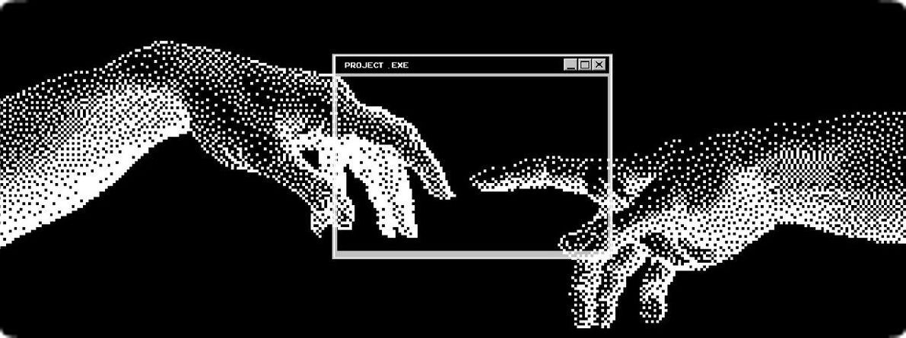

<!-- ░░░░░░░░░░░░░░░░░░ BANNER ░░░░░░░░░░░░░░░░░░ -->
<div align="center">


<!--
  OPCIONAL: reemplaza el banner de arriba por tu propia imagen
  (por ejemplo la del apretón de manos wireframe + halftone).
  1) Crea una carpeta  assets/  en este repo y sube la imagen como  assets/banner.jpg
  2) Descomenta la línea de abajo y borra la  de capsule-render.

  
-->

<a href="https://git.io/typing-svg">
  
</a>

<br/>


</div>

<br/>

<!-- ░░░░░░░░░░░░░░░░░░ CONNECT ░░░░░░░░░░░░░░░░░░ -->
<div align="center">

<a href="https://www.linkedin.com/in/mar%C3%ADa-alejandra-mar%C3%ADn-ter%C3%A1n-99314334b/">
  
</a>
<a href="mailto:maria1313marin@gmail.com">
  
</a>
<!-- <a href="https://TU_PORTAFOLIO.com"></a> -->

</div>

<br/>

<!-- ░░░░░░░░░░░░░░░░░░ ABOUT ░░░░░░░░░░░░░░░░░░ -->
## `> about_me`

```js
const maria = {
  name:      "María Alejandra Marín",
  studies:   "Ingeniería Informática · UCAB · 6to semestre",
  passion:   ["Sistemas de bases de datos", "Ingeniería de software"],
  strengths: ["Proactiva", "Organizada", "Responsable", "Trabajo en equipo"],
  stack:     ["JavaScript", "React", "Node.js", "PostgreSQL", "Docker", "n8n"],
  languages: { es: "Nativo", en: "Profesional básico" },
  mindset:   "Si lo puedes imaginar, lo puedes programar.",
};
```

> Soy estudiante de Ingeniería Informática apasionada por los **sistemas de bases de datos** y la **ingeniería de software**. Me gusta construir sistemas completos, desde el modelo de datos hasta la interfaz, y cuidar que cada capa sea clara, ordenada y fácil de usar. Me motiva aprender y adaptarme rápido a nuevos entornos.

<br/>

<!-- ░░░░░░░░░░░░░░░░░░ TECH STACK ░░░░░░░░░░░░░░░░░░ -->
## `> tech_stack`

<div align="center">

**Lenguajes**


**Frontend**


**Backend & Automatización**


**Bases de datos**


**Herramientas & Diseño**


</div>

<br/>

<!-- ░░░░░░░░░░░░░░░░░░ PROJECTS ░░░░░░░░░░░░░░░░░░ -->
## `> featured_projects`

<table>
  <tr>
    <td valign="top">

### 📇 CRM · 2jmcMedios
`Feb 2026 – Abr 2026`

Sistema de Gestión Comercial totalmente personalizado para la empresa 2jmcMedios. Arquitectura **MVC de silos estrictos**.

- API REST con **Express.js**: clientes, contactos, vendedores y visitas
- **PostgreSQL** desplegado con **Docker Compose** y aprovisionamiento automático vía SQL
- Interfaz dinámica con **React + Vite** y diseño responsivo con **Tailwind CSS**

`JavaScript` `Node.js` `Express` `React` `Vite` `PostgreSQL` `Docker` `Tailwind`

[**Ver repositorio →**](https://github.com/marinm-42xp/crm-2jmcmedios)

</td>
  </tr>
  <tr>
    <td valign="top">

### 🍦 Il Gelato Della Nonna
`Ingeniería de Software · UCAB`

Proyecto web desarrollado en equipo para la materia de Ingeniería de Software. Arquitectura de componentes **MVC**, backend con Express y base de datos gestionada con Docker.

`JavaScript` `Express` `MySQL` `Docker` `MVC`

[**Ver repositorio →**](https://github.com/marinm-42xp/Il-Gelato-Della-Nonna)

</td>
  </tr>
  <tr>
    <td valign="top">

### 🧱 LEGO · UCAB · SBD
`Oct 2025 – Ene 2026`

Proyecto de Sistemas de Bases de Datos: sistema de gestión desarrollado en **PL/SQL** sobre **Oracle Database**.

- Procedimientos almacenados y consultas complejas
- Diseño y optimización de esquemas de base de datos

`PL/SQL` `Oracle Database`

[**Ver repositorio →**](https://github.com/marinm-42xp/LEGO-UCAB-SBD)

</td>
  </tr>
</table>

<br/>

<!-- ░░░░░░░░░░░░░░░░░░ EXPERIENCE ░░░░░░░░░░░░░░░░░░ -->
## `> experience`

```text
[2025 → presente]  Asesor de medios digitales
                   Parroquia San Pío X · Templo San Judas Tadeo
                   > Gestión y creación de contenido para Instagram y Facebook
                   > Diseño y programación de publicaciones, historias y cápsulas
                   > Comunicación digital que fortalece el sentido de comunidad
```

<br/>

<!-- ░░░░░░░░░░░░░░░░░░ CURRENT FOCUS ░░░░░░░░░░░░░░░░░░ -->
## `> current_focus`

```bash
$ cat focus.txt

[■■■■■■■■□□] Modelado y optimización de bases de datos
[■■■■■■■□□□] Technical Writer
[■■■■■□□□□□] Automatización de flujos con n8n
[■■■■□□□□□□] Metodologías ágiles · Scrum

$ _
```
<br/>

<!-- ░░░░░░░░░░░░░░░░░░ CERTIFICATIONS ░░░░░░░░░░░░░░░░░░ -->
## `> certifications`
- 🔵 **Scrum Master** · Coursera · 2026

<!-- ░░░░░░░░░░░░░░░░░░ STATS ░░░░░░░░░░░░░░░░░░ -->
## `> github_analytics`

<div align="center">


<br/>


<br/>


</div>

<br/>

<!-- ░░░░░░░░░░░░░░░░░░ FOOTER ░░░░░░░░░░░░░░░░░░ -->
<div align="center">

```text
┌──────────────────────────────────────────────┐
│  ¿Tienes una idea o un proyecto en mente?    │
│  Construyámoslo.  →  hablemos por LinkedIn   │
└──────────────────────────────────────────────┘
```


</div>
